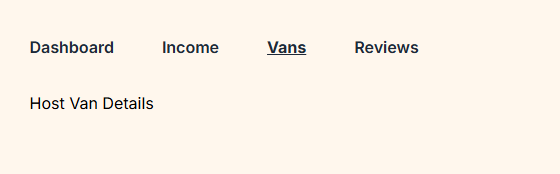
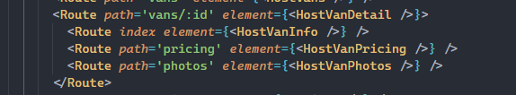

# Van Life

A multi page Van Rental application with protected routes and authentication.

Day #1

- Setting up project structure
- Setup new Tailwind 4
- Setup BrowserRouter, Routes in main.jsx
- Huge issues with Tailwind 4 reverted back to 3.14
- got rid of the tailwind from vite.config.js and added normal content to tailwind.config.js
- Created Navbar, footer and Routes for About, Home page.

Day #2

- Setting up a fake test server with miragejs
- set up new van page route and van page component
- styled the van page with all vans
- add new VanDetail page
- set up Link to direct to vans/${van.id}
- adding aria-label on the Link tag for better accessibility when product is clicked. It provides description about the product for the screen readers.
- useParams from react router dom get the id parameter from the url
- Started nested routes for NavBar using Layout react router dom

## Day #3

- adding new HostLayout Routes just for Hosts using Outlet
- using Relative path routes for better route readability
- adding index routes for certain nested routes that have the same route as the parent route
- refactored Navbar and Footer into the Layout component and not in the App.jsx. The Outlet is in between Navbar and Footer.
- Added NavLink to all Links so we can access isActive property and apply conditional css styles. We applied this to the navbar Links and the HostLayout links. NavLink can take a function as a callback and one of the inherent object properties is has is an isActive property we can get access to.
- A bug is found. When clicking on any HostLayout NavLink lets say /host/reviews it highlights three urls. `/, /host, /host/dashboard` so when we click on the `/host/reviews` it will also make /host/dashboard active. To fix this bug we add `end` property to `/host` route in the HoustLayout and it wont highlight the /host/dashboard. `end` tells react router dom to end the matching urls here.
- created an extra NavLink called Vans in the HostLayout. Added HostVan and HostVanDetails components in the Host pages
  
- update server.js with extra host data and get requests.

```
  this.get("/host/vans", (schema, request) => {
  // Hard-code the hostId for now
  return schema.vans.where({ hostId: "123" });
  });

  this.get("/host/vans/:id", (schema, request) => {
  // Hard-code the hostId for now
  const id = request.params.id;
  return schema.vans.where({ id, hostId: "123" });
  });
```

- Added ``  hostId: "123"` random host key values pairs to link hosts with certain vans
- List all the HostVans in the /host/vans. Use map, useEffect, useState
- Created the /host/vans > HostVans.jsx css and styling
- Styled the Shared UI portion of the HostVanDetail.jsx
- Add CSS and Styling to the HostVanDetails page with NavLinks for Details, Pricing and Photos
- Added type buttons in the VanDetails page

## Day #4

- Adding Relative Routes/Links in our Top parent link containers
- Changed NavLink to property = "."
- This makes it easier for us whenever we need to change the top level parent route container links.
- Back to all vans feature using ".." in Link to property to go back to all vans from vandetails page.
- However using ".." will take us back to the parent route container which is "/host". This isnt what we want.
  We want to go back to "/host/vans" just one level up the route path.
- We solve this by adding relative="path" to our Link
- Setting up Routes for the Hosts Details section, HostVanInfo, HostVanPricing, HostVanPhotos
- Setting up nested routes in the App.jsx
  
- add new NavLinks in Details, Pricing, Photos in the HostVanDetails Page.
- How do we get the data inside each one of the HostDetails section for Details, Pricing and Photos??
- Solution: Outlet Context. This makes it easy for us to get information and pass it as props to an Outlet. That means any component that uses the Outlet can get access to this data.
- pass a prop called context={van} van is the van object we fetched via the api
- then on child routes we use the useOutletContext. We then destructure the {van } = useOutletContext();
- We are now able to render the data get specific data to render
- Adding a searchParams from react router dom into the query or search string to be able to either filter, sort or add pagination. In our case, we can filter wit hthe searchParams in the url string. Search params will read the parameters in the URL.
- We added a filterVans method when a ?type=rugged or simple or luxury is in the url path
- How can we now do this dynamically instaed of us typing in the query string? For instance how can we filter based on a filter button dropdown by type? First we can add a Link element
- Added filter button links by Type in /vans
- Added clear filter button as well in /vans.
- If we want to clear the query pararmeter we can add in the Link to="" or to="." Both will work.
-
