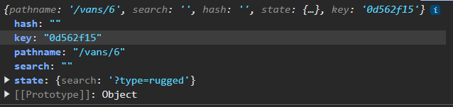

# Van Life

A multi page Van Rental application with protected routes and authentication.

Day #1

- Setting up project structure
- Setup new Tailwind 4
- Setup BrowserRouter, Routes in main.jsx
- Huge issues with Tailwind 4 reverted back to 3.14
- got rid of the tailwind from vite.config.js and added normal content to tailwind.config.js
- Created Navbar, footer and Routes for About, Home page.

Day #2

- Setting up a fake test server with miragejs
- set up new van page route and van page component
- styled the van page with all vans
- add new VanDetail page
- set up Link to direct to vans/${van.id}
- adding aria-label on the Link tag for better accessibility when product is clicked. It provides description about the product for the screen readers.
- useParams from react router dom get the id parameter from the url
- Started nested routes for NavBar using Layout react router dom

## Day #3

- adding new HostLayout Routes just for Hosts using Outlet
- using Relative path routes for better route readability
- adding index routes for certain nested routes that have the same route as the parent route
- refactored Navbar and Footer into the Layout component and not in the App.jsx. The Outlet is in between Navbar and Footer.
- Added NavLink to all Links so we can access isActive property and apply conditional css styles. We applied this to the navbar Links and the HostLayout links. NavLink can take a function as a callback and one of the inherent object properties is has is an isActive property we can get access to.
- A bug is found. When clicking on any HostLayout NavLink lets say /host/reviews it highlights three urls. `/, /host, /host/dashboard` so when we click on the `/host/reviews` it will also make /host/dashboard active. To fix this bug we add `end` property to `/host` route in the HoustLayout and it wont highlight the /host/dashboard. `end` tells react router dom to end the matching urls here.
- created an extra NavLink called Vans in the HostLayout. Added HostVan and HostVanDetails components in the Host pages
  
- update server.js with extra host data and get requests.

```
  this.get("/host/vans", (schema, request) => {
  // Hard-code the hostId for now
  return schema.vans.where({ hostId: "123" });
  });

  this.get("/host/vans/:id", (schema, request) => {
  // Hard-code the hostId for now
  const id = request.params.id;
  return schema.vans.where({ id, hostId: "123" });
  });
```

- Added ``  hostId: "123"` random host key values pairs to link hosts with certain vans
- List all the HostVans in the /host/vans. Use map, useEffect, useState
- Created the /host/vans > HostVans.jsx css and styling
- Styled the Shared UI portion of the HostVanDetail.jsx
- Add CSS and Styling to the HostVanDetails page with NavLinks for Details, Pricing and Photos
- Added type buttons in the VanDetails page

## Day #4

- Adding Relative Routes/Links in our Top parent link containers
- Changed NavLink to property = "."
- This makes it easier for us whenever we need to change the top level parent route container links.
- Back to all vans feature using ".." in Link to property to go back to all vans from vandetails page.
- However using ".." will take us back to the parent route container which is "/host". This isnt what we want.
  We want to go back to "/host/vans" just one level up the route path.
- We solve this by adding relative="path" to our Link
- Setting up Routes for the Hosts Details section, HostVanInfo, HostVanPricing, HostVanPhotos
- Setting up nested routes in the App.jsx
  
- add new NavLinks in Details, Pricing, Photos in the HostVanDetails Page.
- How do we get the data inside each one of the HostDetails section for Details, Pricing and Photos??
- Solution: Outlet Context. This makes it easy for us to get information and pass it as props to an Outlet. That means any component that uses the Outlet can get access to this data.
- pass a prop called context={van} van is the van object we fetched via the api
- then on child routes we use the useOutletContext. We then destructure the {van } = useOutletContext();
- We are now able to render the data get specific data to render
- Adding a searchParams from react router dom into the query or search string to be able to either filter, sort or add pagination. In our case, we can filter wit hthe searchParams in the url string. Search params will read the parameters in the URL.
- We added a filterVans method when a ?type=rugged or simple or luxury is in the url path
- How can we now do this dynamically instaed of us typing in the query string? For instance how can we filter based on a filter button dropdown by type? First we can add a Link element
- Added filter button links by Type in /vans
- Added clear filter button as well in /vans.
- If we want to clear the query pararmeter we can add in the Link to="" or to="." Both will work.
- Refactored the filter buttons using the setSearchParams setter function.

```

 <div className='flex flex-wrap w-full gap-2 xs:w-auto'>
            {Object.keys(colorOptions).map((type) => (
              <button
                key={type}
                className='no-underlines'
                onClick={() => setSearchParams({ type: type })}
              >
                <span
                  className={`inline-block px-4 py-2 capitalize bg-[#ffead0] max-w-[100px] text-center  rounded text-black mr-2 cursor-pointer
              }`}
                >
                  {type}
                </span>
              </button>
            ))}
          </div>

```

````<button
            onClick={() => setSearchParams({})}
            className='flex w-full mt-4 ml-2 xs:ml-0 xs:w-auto xs:mt-0'
          >
            <span
              className={`inline-block  py-2 capitalize  w-full text-left  rounded text-black mr-2 cursor-pointer  underline
              }`}
            >
              Clear filter
            </span>
          </button>
          ```
````

- Merging Query Parameters...just started

## Day #5

- Merging search params with setSearchParams function. No idea here.
- Conditionally rendering the clear filter button when typeFilter is true.
- conditionally rendering background color and text color when type button is clicked.
- ```<span
                 style={{
                   backgroundColor:
                     typeFilter === type ? colorOptions[type] : "#ffead0",
                   color: typeFilter === type ? "white" : "black",
                 }}
                 className={`inline-block px-4 py-2 capitalize max-w-[100px] text-center rounded mr-2 cursor-pointer`}
               >
                 {type}
               </span>

  ```

- Adjusting some absolute paths with relative paths in /host/vans/id and /vans/id
- Adding back to vans button in /vans/id. We can just copy the same one from /host/vans/id. However there is a problem for the user flow. When we click back to all vans, it loses all our filter options. This is okay for one filter but what if we were filtering for more than one option? How do we solve this?
- We can do this by using some Link state. We can pass a sate as prop with a value of object with key value pairs and then change it to a string. For example. ` state={{ search: searchParams.toString()}}`

````<Link
              // saves search params to url
               state={{ search: `?${searchParams.toString()}` }}
              to={van.id}
              key={van.id}
              aria-label={`View details for ${van.name},
                             priced at $${van.price} per day`}
            >```
````

- so we are passing a state through the Link but how do we receive the state in the child routes? useLocation.
- we need to use it now ` const location = useLocation();`
- the location is an object. 
- Now we can add the code to see if location.state exists then access its search key property otherwise it should return an empty string. ``  to={`..${location.state?.search || ""}`}``
- Added `  <span className='text-sm hover:underline'>
  Back to all {van?.type} vans
</span>` for better customization
- Alternatively you can use the add another property like type: typeFilter and add it into the state prop state={{ search: `?${searchParams.toString()}, type: typeFilter` }} but i thought it wasnt necessary as we have access to the van object already, we can just use the van.type.
- adding a 404 error page. We use something called a splat route or catch all route.
- adding paths that are sad meaning, paths that are not working properly like fetching data, etc. What do we do in that situation? Error handling, loading states, form validation
- Fixing some hygiene. Currently we have a lot of useEffect fetch requests in different parts of the page and this can cause a lot of problems. Maybe its a good time to use or create a specific utlitilty function for this in a separate component.
- created a new getVans() in api.js to call all our vans.
- setting loading states in react just for the vans page. We could do it for all the different sections. **Come back to this later**
- How to better manage error handling? For now we can add some error handling in the getVans fetch function.
- setting a loading and error states in the Vans page
- Adding error and loading state in the async function loadvans
- adding loading and error conditions before the return of our jsx
- updating api.js to handle both error states for both response and data errors
- now that some error handling has been used in the Vans page, the same error handling will have to be used in some of the other components. Thats a lot of repetitive code. The problem here is we are starting the fetch request before the component has been loaded. We are prematurely jumping to this route and starting a fetch request before the component has loaded. This is where React Server Components, Next JS or Remix can help in this. aka Data layer APIs
- adding accessibility improvements by adding aria-live polite or assertive
- Added Login Route to App.jsx
- Styled Login Form

## Day #6

- Add Protected Login Host Routes
- Created a a new AuthRequired Layout that wraps all the Host Routes
- Added Login image to the Navbar
- So if you go to /host it will redirect to the /login page. However the user experience isnt great
- Adding a custom message using the state prop and passing in a message in the Navigate component in AuthRequired.
- Back in the Login.jsx page we use the useLocation hook to receive the state. `  const location = useLocation();`
- we need to check if location.state.message exists and if it does printout the message
- ````{location.state?.message && (
          <div className='bg-white rounded-lg mx-auto max-w-[500px] p-8 mt-4 shadow-sm'>
            <h3 className='text-xl font-bold text-center text-black'>
              {location.state.message}
            </h3>
          </div>
        )}```
  ````

- In our api.js added loginUser function and getHostVans async functions to fetch data.
- Updated the server file for login post
- Adding loading and error states with try catch block in useEffect in VanDetails, Vans, HostVans, HostVanDetails
- From the input data from our login page we can use that info in the loginUser function

## Day #7

- Yesterday there was a bug issue. Whenever i tried to login without any credentials it should say the error message in the server.js file When submitting empty credentials, the server is still returning a 200 status code instead of the expected 401 error.
- The issue was the structure of the server.js file. It had extra curly braces.
- Redirecting after successful login to the /host page using useNavigate.
- Bug\*\* the You must Log in first message keeps showing up on the host route even after refresh. Solution -- History Stack -- { replace: true}. We also add replace property to the AuthRequired Navigate. Without replace each navigations adds a new entry to the browsers history stack. Pressing back takes you to the previous page. Replace replaces the current entry in the history stack. Think of replace: true as saying "forget where we just were" instead of "remember where we just were". This concept was much trickier than I thought.

```
With replace
Redirected to login with replace:
[/] -> [/login]    // replaces /host

After successful login with replace:
[/] -> [/host]     // replaces /login

// Now when user clicks "back":
// they only go to / (clean!)
```

```
Without replace
Initial stack:
[/]              <-- Top

Try to visit /host:
[/host]          <-- Top
[/]

Redirect to login (no replace):
[/login]         <-- Top
[/host]
[/]

After login (no replace):
[/host]          <-- Top
[/login]
[/host]
[/]
```

- Bug\*\* when i login with correct credentials it doesnt allow me to navigat to /host because AuthRequired has a const authenticated = false hardcoded. How can we let them know to change it to true? --- Solution `   localStorage.setItem("loggedin", true);` Then we import the `  const authenticated = localStorage.getItem("loggedin");`
- How do I now make the Log Out button appear only if loggedin and not appear when logged out? Solution -- use the localStorage.getItem() set it as a variable and use that to conditionally render the button.
- Another user experience issue is when logged in the /login page still shows Sign In form page. This is a bad user experience. Solution -- useEffect. On initial component mount we need to check if the user is authenticated or not. If authenticated redirect to the /host page.
- Bug\*\* when i log in when through /host page the Log Out button doesnt show up but it does after i manually reload! Solution --- the button isnt being rendered because simply using the localStorage as the value for authentication doesnt trigger a re-render of the components. Until i manually rerender does it read the localStorage Value. This means we need access to this localStorage state at a higher level that tracks auth status. -- Create an AuthContext() in context folder and pass it as children
- We can also go straight to the previous route we were in before being logged in. So after we get logged in, it redirects us straight away to the page were browsing at. e.g. we were at /host/vans/1 --> we need to login at /login then after login it redirects us straight to /host/vans/1
  Solution -- `const location = useLocation()` in Authrequired. Also added ` state={{ message: "You must log in first", from: location.pathname }}` to our Navigate component in Authrequired. Then back in Login component add `  const from = location.state?.from || "/host";` and add `     navigate(from, { replace: true });` in our loginUser function.

## Day #8

- Add Host Dashboard data and styling
- Add Host Income stats and styling
- Dynamically rendered Host Dashboard data and Income Data.
- This section was pretty difficult.

## Day #9

- Cant seem to login Error handling. Destructuring is email as null. That means the email property is null. Got rid of the loginUser function from api.js. We were calling that from api.js but our login function was being used from AuthProvider causing a conflict. Thats why we got rid of loginUser function.
- Finish Reviews Section
- Finish Styling main page, add footer.

## Day 10-13

- Redesigned Website
- Add new ButtonSet components
- Added new testimonials

## Day 14-16

- responsive navbar
- responive about page
- customer testimonials on small screen sizes
- White side bar showing on very small screens - fixed using overflow-x: hidden

Things to do

1. Search bar - make it responsive
2. Finalize functionality for calendar function
3. Redesign login page
4. Add book route
5. Design and make booking page
6. Hosts dashobard, income, vans, reviews - make it all responsive
7. Van Details Redesign
